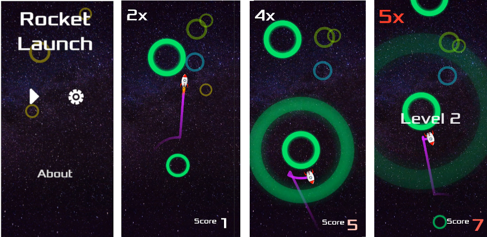

# Rocket Launch: A Godot Engine Game

**Rocket Launch** is an one-touch casual game. 

**Get it** from the [Google Play Store](https://play.google.com/store/apps/details?id=home.cadenzayu.rocketlaunch)

## Game story

You will take a rocket for interstellar travel, flying from one planet to another. Because of the planet's autobiography, you have to choose the best time to launch the rocket so that it can fly to the target planet and be captured by it. If the planet can not capture you, you lose.

Some planets are stable and you can take a break. Some planets are unstable and you must leave as soon as possible. The difficulty will increase over time with planets that move, shrink, and/or expire. Longer the travel time, more scores you get.

The operation is very simple, at the right time, tap the screen to launch.

Tip: When your highest score exceeds 400, you will be rewarded with the privilege of disable ads

Let's go and good luck.

## Thanks

**Rocket Launch** came from a fork of the [Circle Jump](http://kidscancode.org/godot_recipes/games/circle_jump/) project

**Circle Jump** is a mobile game you can learn to make using the Godot Game Engine.

You can follow the development here (written and video tutorials):
[Game Tutorial: Circle Jump](http://kidscancode.org/godot_recipes/games/circle_jump/)

### Support or Contact

Having trouble with Pages? Check out our [documentation](https://docs.github.com/categories/github-pages-basics/) or [contact support](https://support.github.com/contact) and we’ll help you sort it out.
